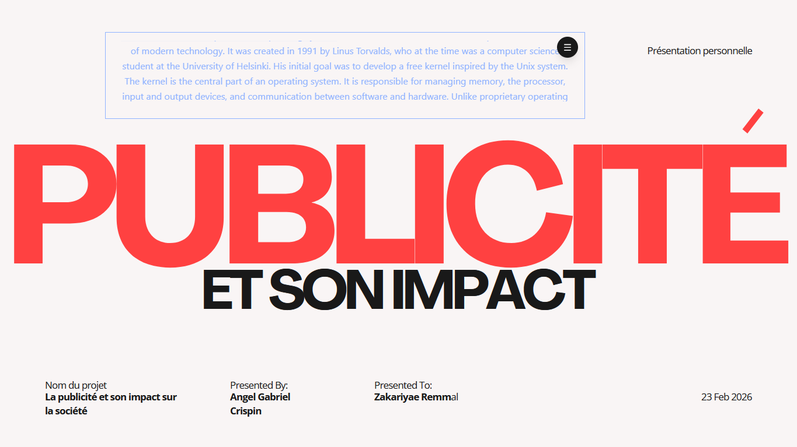
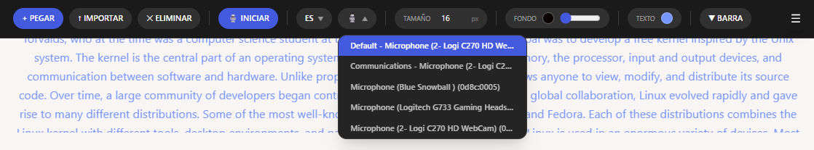
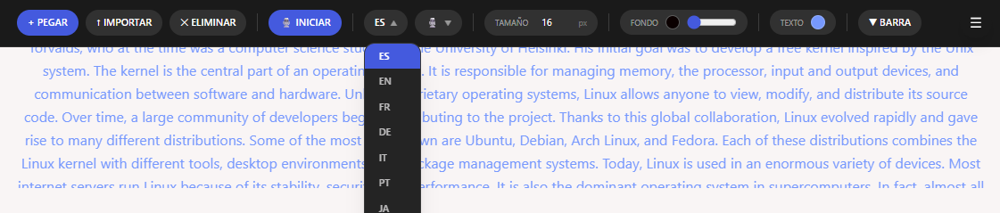

## AI Voice-Synced Teleprompter

An intelligent teleprompter that **listens to the speaker and automatically scrolls the script in real time**.

Instead of using a fixed scrolling speed, the application performs **real-time speech recognition** to detect the words spoken by the user and synchronizes the teleprompter with the script. As the speaker talks, the system identifies the current position in the text and smoothly advances the display.

This allows creators, presenters, and speakers to **talk naturally without worrying about manual scrolling or timing**.

---



---

### Key Features

- 🎤 **Active listening teleprompter** — detects spoken words and syncs with the script in real time
- 🔎 **Word-level alignment** with fuzzy matching between spoken audio and the script
- ⚡ **Real-time scrolling** that adapts to the speaker's natural pace
- 🌍 **Multilanguage support** — Spanish, English, French, German, Italian, Portuguese, Japanese, Chinese, Korean
- 🎙 **Microphone selector** — choose your input device from the UI
- 🖥 **Always-on-top window** — stays visible over other applications during presentations
- 🎨 **Customizable display** — background color, opacity, text color, font size
- 📋 **Paste or import text** — from clipboard or `.txt` file
- 🪟 **Custom title bar** — moveable between top and bottom, hideable
- 🖱 **System tray** — minimize to tray and restore with a click

---

### Demo

**Voice sync & word highlighting**

https://github.com/FaureGalliard/vocal-teleprompter/assets/docs/demo-voice-sync.mp4

**Easy resize**

https://github.com/FaureGalliard/vocal-teleprompter/assets/docs/demo-resize.mp4

**Color customization**

https://github.com/FaureGalliard/vocal-teleprompter/assets/docs/demo-color.mp4

---

### UI

| Toolbar                                 | Microphone selector                           | Language selector                         |
| --------------------------------------- | --------------------------------------------- | ----------------------------------------- |
|  |  |  |

---

### Download

Go to the [Releases](https://github.com/FaureGalliard/vocal-teleprompter/releases) page and download the latest installer for your platform.

> **Windows SmartScreen warning**: Since this app is not yet code-signed, Windows may show a security warning on first launch. Click **"More info" → "Run anyway"** to proceed. The app is open source and safe to use.

---

### Tech Stack

- **React + TypeScript** — user interface
- **Vite** — frontend build tool
- **Tailwind CSS v4** — styling
- **Tauri v2** — cross-platform desktop application framework
- **Rust** — native backend and system integration
- **Web Speech API** — real-time speech recognition (low latency, no cost, no internet required)
- **Tauri Plugins** — clipboard, file dialog, file system, opener

---

### How It Works

```
Microphone → Web Speech API → Transcript
                                  ↓
                         Fuzzy word matcher
                                  ↓
                    Current position in script
                                  ↓
                    Smooth auto-scroll + highlight
```

The fuzzy matcher normalizes text (removes accents, lowercases, strips punctuation) and uses edit-distance matching so the system stays in sync even when the speaker mispronounces or skips words.

---

### Use Cases

- YouTube creators
- Presentations and talks
- Podcasts
- Video recording
- Live streaming

---

### Publishing a Release

1. Build the app:

```bash
npm run tauri build
```

2. The installers will be generated at:

```
src-tauri/target/release/bundle/nsis/vocal-teleprompter_x.x.x_x64-setup.exe
src-tauri/target/release/bundle/msi/vocal-teleprompter_x.x.x_x64.msi
```

3. Go to your GitHub repository → **Releases** → **Draft a new release**
4. Create a new tag (e.g. `v0.1.0`)
5. Upload the `.exe` and `.msi` files as release assets
6. Write release notes and click **Publish release**

---

### Recommended IDE Setup

[VS Code](https://code.visualstudio.com/) + [Tauri](https://marketplace.visualstudio.com/items?itemName=tauri-apps.tauri-vscode) + [rust-analyzer](https://marketplace.visualstudio.com/items?itemName=rust-lang.rust-analyzer)
